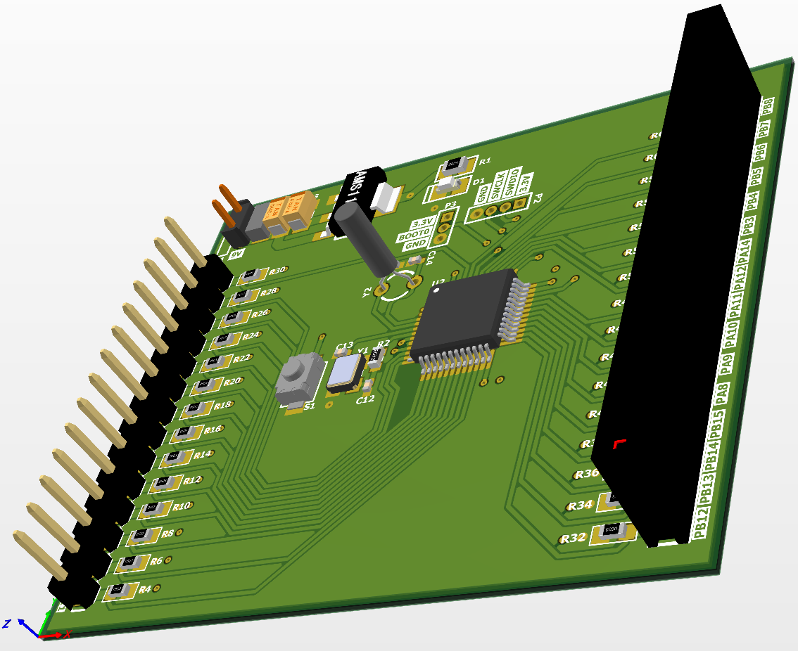
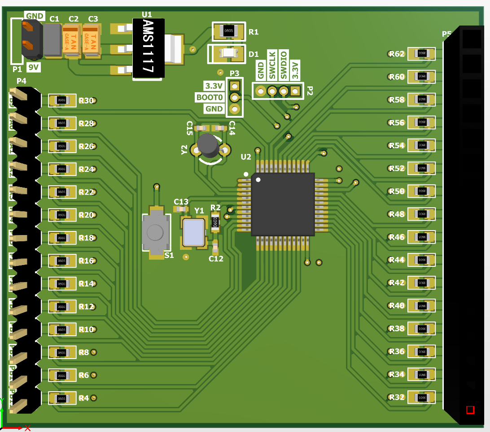
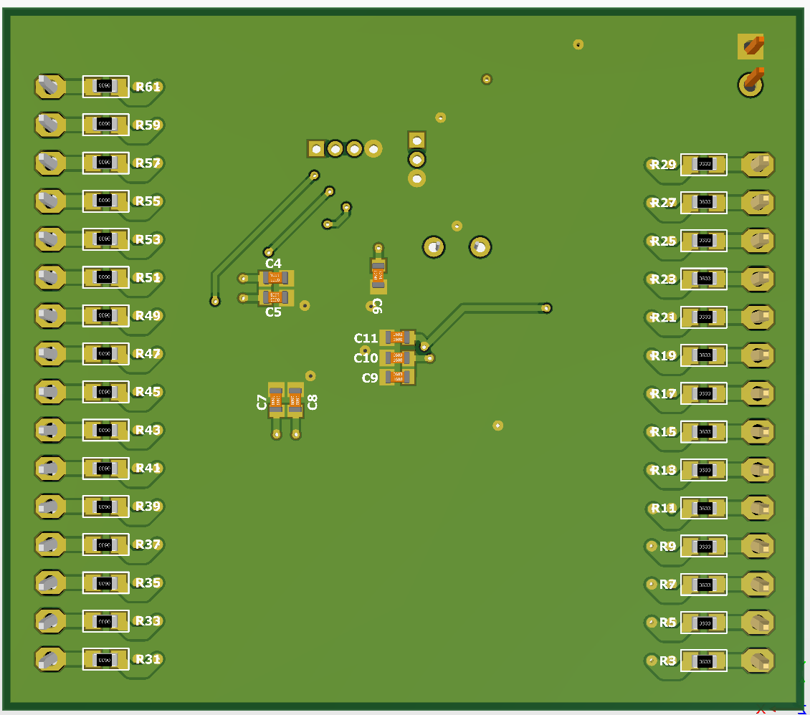
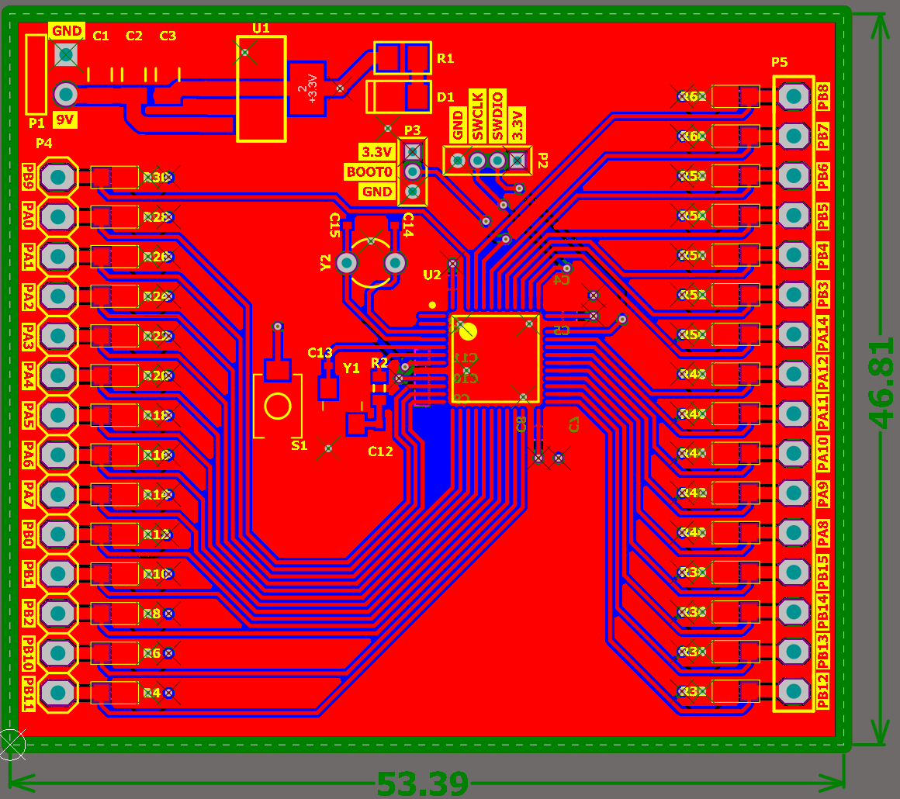
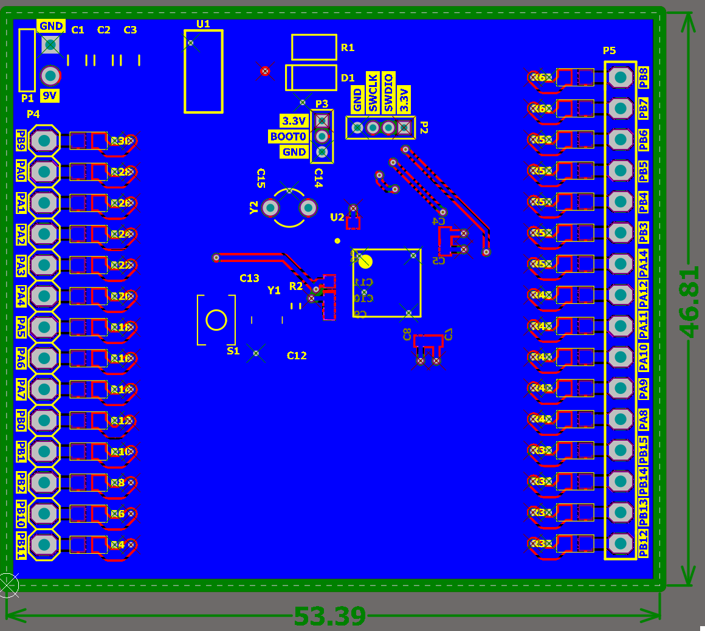

# SmartMCU

## Overview
SmartMCU is an Altium Designer project for an STM32F303VC microcontroller board. The project consists of a main microcontroller section and a power supply circuit utilizing the LM1117 voltage regulator. It also includes an 8MHz external oscillator (ECS-80). 

The repository contains the complete Altium schematic documents (`MCU.SchDoc`, `PowerSupply.SchDoc`, `main.SchDoc`) and the finalized PCB layout (`smartmcu.v2.PcbDoc`).

## 3D Views & PCB Layout
Here are some renders and layout views of the SmartMCU board:

### 3D Board Views

### Layer Views

## Gerber Files
**Note:** The Gerber files currently present in the `Project Outputs for smartmcu` directory are **out of date**. They were created prior to the recent PCB design changes and cosmetic adjustments. Please regenerate them from the latest `smartmcu.v2.PcbDoc` before manufacturing.

## Version History & Pull Requests
The project has evolved through the following significant Pull Requests:

- **PR #4: feature/gebber-files-n-pcb-cosmetics**
  - Generated the initial set of Gerber files (now out of date) and applied various cosmetic updates to the board layout.
- **PR #3: feature/finish-pcb**
  - Finished the PCB wiring and finalized the silkscreen/overlay text.
- **PR #2: feature/add-3d-body-mcu**
  - Added 3D body models for the STM32 MCU and other 2-pin components.
